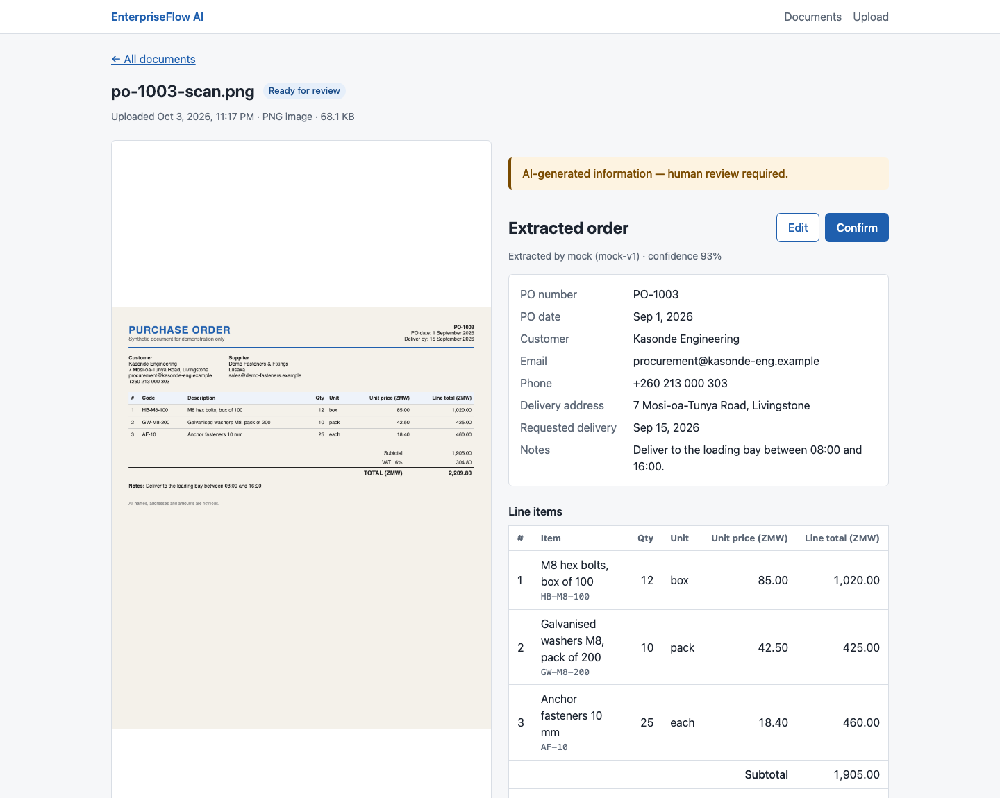
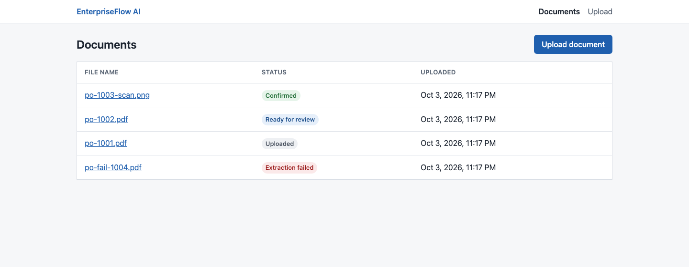
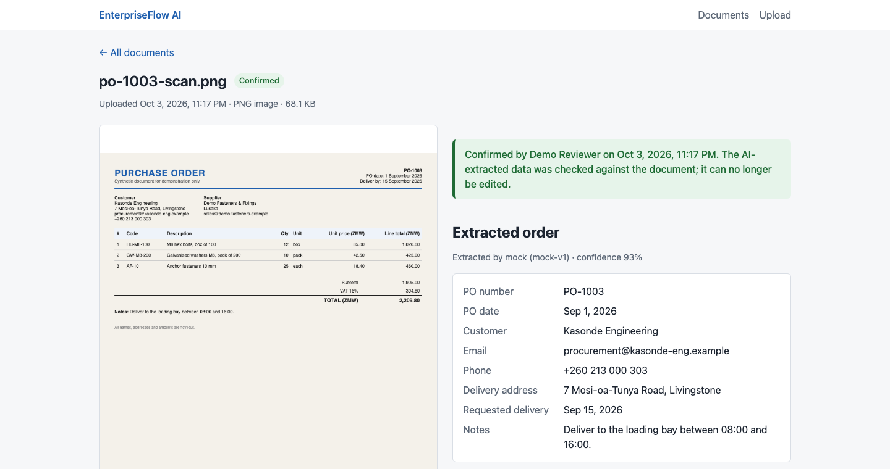
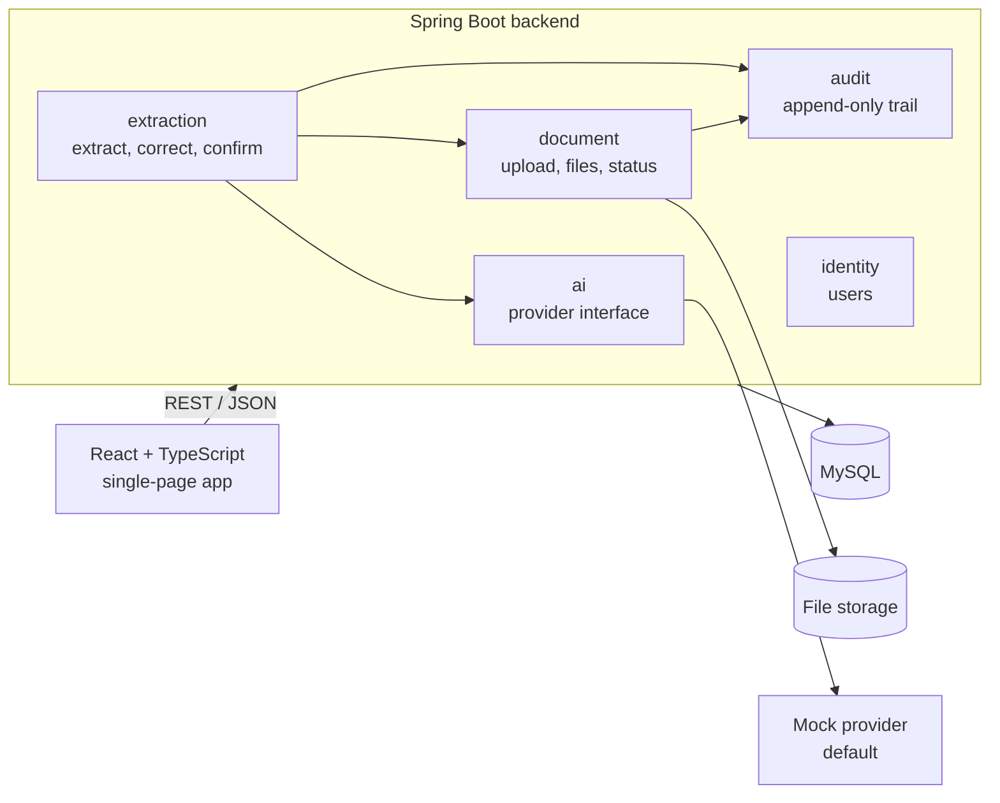

# EnterpriseFlow AI Demo

[](https://github.com/NgaseBupe/enterpriseflow-ai-demo/actions/workflows/ci.yml)

**AI-assisted purchase order intake with human review.** A reviewer uploads a customer purchase order, AI extracts the order details and line items, and a person checks the result against the original document, corrects it and confirms it. Every step is recorded in an audit trail.

> **The AI assists; a human decides.** The system never accepts or rejects an order. "Confirmed" means only that the extracted data matches the document.



---

## The problem

Wholesalers, manufacturers and distributors receive purchase orders as PDFs, scans and phone photos. Staff re-type them by hand, which is slow, and a mistyped quantity or price becomes a wrong delivery or a wrong invoice. AI can read these documents, but it also makes mistakes, so its output needs a fast, accountable human check before anyone relies on it.

## What the demo does

1. **Upload:** PDF, PNG or JPEG up to 10 MB. The file type is detected from the file's content, not its name.
2. **Extract:** AI reads the order header and line items. Failures show a readable reason and can be retried.
3. **Review:** the original document is shown next to the extracted data, clearly marked *AI-generated*.
4. **Correct:** fix any field or line value. Every input is validated, and edits are protected against overwriting a colleague's changes.
5. **Confirm:** a deliberate confirmation step locks the data and records who confirmed it and when.
6. **Audit:** uploads, extraction attempts, corrections and confirmations are all recorded.

| Documents | Confirmed |
|---|---|
|  |  |

## Current status

This is a **portfolio project delivered in sprints**, and it is in active development. **Sprint 1 (walking skeleton) is complete:** the full workflow above works end to end.

**About the AI:** the app currently runs on a built-in **simulated AI** (a mock provider). It returns a fixed purchase order instead of reading the file, so the demo runs without an API key and tests are deterministic. The [sample documents](sample-documents/) are printed with exactly what the mock returns, so they show matching data. A real model (Google Gemini) is planned behind the same interface.

Upcoming work includes validation and arithmetic checks on the extracted totals, login and roles, an audit timeline, the real AI provider, and a one-command Docker setup. See the [delivery backlog](docs/backlog.md).

## Architecture

A **modular monolith**: one Spring Boot application, organised into business modules with boundaries that are checked automatically.



Engineering highlights:

- **Module boundaries checked by a test** (Spring Modulith). Modules share data by ID only.
- **The AI call runs outside database transactions**, so a slow provider never holds a connection. A failure leaves no partial data.
- **Atomic status changes:** when two people press Extract at once, exactly one AI call happens.
- **Version checks on every edit and confirmation**, so nobody overwrites or confirms data they haven't seen.
- **Time-ordered UUIDv7 keys** stored as `BINARY(16)`, which suits MySQL's clustered indexes.
- **Every error in one format** (RFC 9457 Problem Details), with a message per invalid field.
- **Files served defensively:** detected content type, `nosniff`, restrictive content security policy.

Full design: [docs/design-proposal.md](docs/design-proposal.md)

## Engineering process

- **Agile delivery:** user stories with acceptance criteria, a Definition of Done, and pull requests that close their issues.
- **Code review is part of "done":** every finding is recorded with its root cause, impact, fix and evidence in the [review log](docs/review-log.md). Fixes are checked by reverting them and watching the test fail.
- **CI on every pull request:** backend build and tests against a real MySQL (Testcontainers), and frontend lint, type check, tests and build.

## Tech stack

| Area | Technology |
|---|---|
| Backend | Java 17, Spring Boot 3.5, Spring Data JPA, Bean Validation, Flyway, Spring Modulith |
| Database | MySQL 8.4 |
| Frontend | React 19, TypeScript (strict), Vite, React Router, TanStack Query, React Hook Form, Zod |
| Testing | JUnit 5, AssertJ, Mockito, MockMvc, Testcontainers, Vitest, React Testing Library, MSW |
| Tooling | Maven Wrapper, oxlint, GitHub Actions, Dependabot |

## Running locally

**Prerequisites:** Java 17, Node.js 22, and Docker (running).

```bash
# 1. Backend on http://localhost:8080. Starts a temporary MySQL in Docker; no database setup needed.
cd backend
./mvnw spring-boot:test-run

# 2. Frontend on http://localhost:5173, in a second terminal
cd frontend
npm install
npm run dev
```

Open **http://localhost:5173** and upload a file from [`sample-documents/`](sample-documents/).

To see a failed extraction and the retry, upload any PDF whose name contains `fail`.

> The database is temporary: it is discarded when the backend stops. A permanent setup with Docker Compose is planned.

## Running the tests

```bash
cd backend && ./mvnw verify                                    # backend: unit and integration tests (Docker required)
cd frontend && npm run lint && npm run typecheck && npm test   # frontend
```

## Documentation

| Document | Contents |
|---|---|
| [Design](docs/design-proposal.md) | Requirements, architecture, data model, API, AI boundary, security and testing strategy |
| [Delivery backlog](docs/backlog.md) | Every sprint's tasks, done and planned |
| [Review log](docs/review-log.md) | Every review finding: problem, root cause, impact, fix and validation |

## Disclaimer

This project is a demonstration and uses **synthetic data only**. All companies, people, addresses and amounts are fictitious. It is not an order-management system and does not accept, reject or process orders.

## Copyright

© 2026 Bupe Ngase. All rights reserved. This repository is shared publicly for portfolio evaluation; no licence is granted to copy, modify or redistribute the code.
